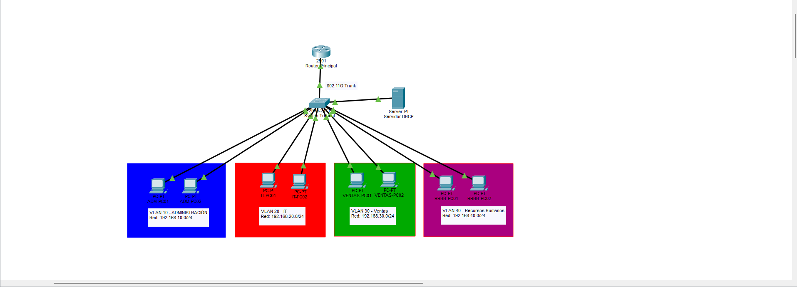
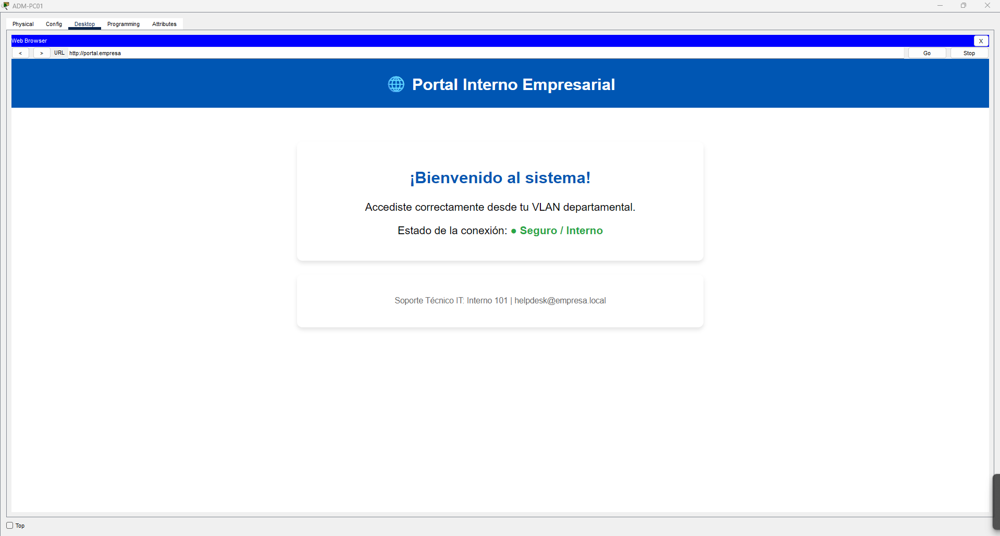

Topología de Red Corporativa con VLANs y DHCP

Este es un proyecto de simulación hecho en Cisco Packet Tracer que implementa una red segmentada para una empresa mediana.

## 📸 Topología de la Red
)

## 🛠️ Características Implementadas
* **Segmentación por VLANs:** Separación de tráfico para 4 departamentos (Administración, IT, Ventas, RRHH).
* **Enrutamiento Inter-VLAN:** Configuración de Router-on-a-Stick mediante enlace troncal 802.11Q.
* **Asignación Dinámica de IPs:** Esta implementado un Servidor DHCP centralizado para proveer direccionamiento automático a todas las subredes.

## 📊 Direccionamiento IP
* **VLAN 10 (Administración):** 192.168.10.0/24
* **VLAN 20 (IT):** 192.168.20.0/24
* **VLAN 30 (Ventas):** 192.168.30.0/24
* **VLAN 40 (RRHH):** 192.168.40.0/24
## 🌐 Servicio Web y DNS Configurado

Los usuarios de cualquier VLAN pueden acceder al portal corporativo interno mediante la resolución de nombres DNS:

